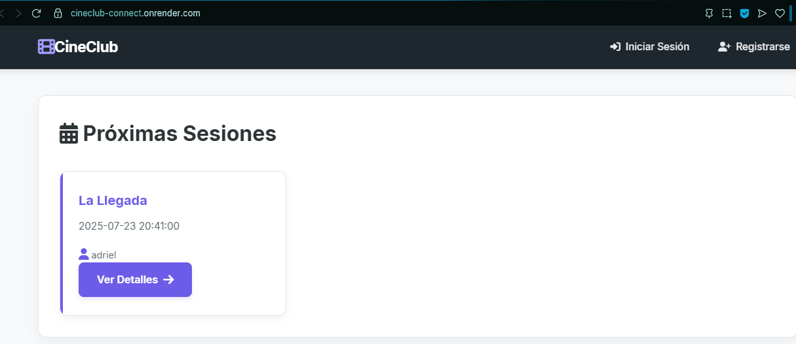
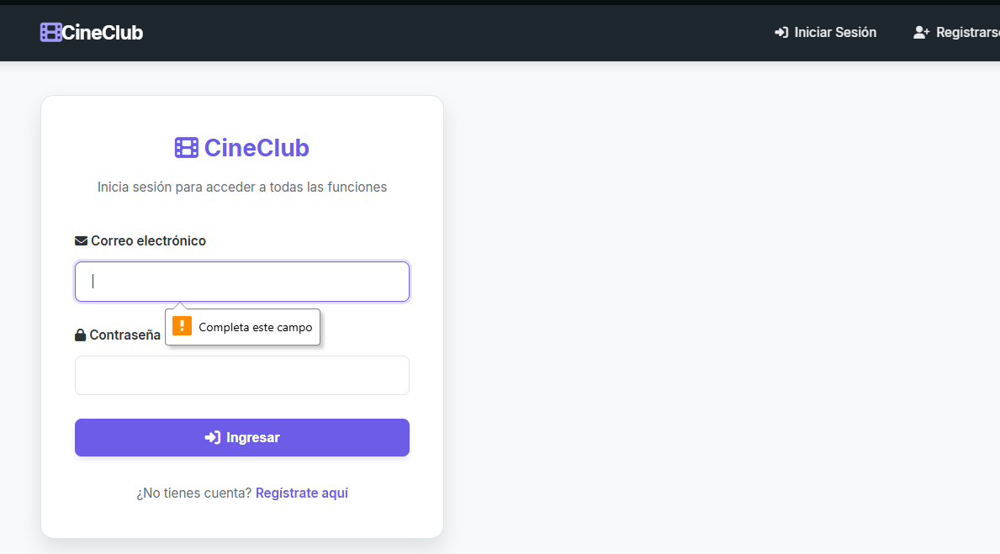
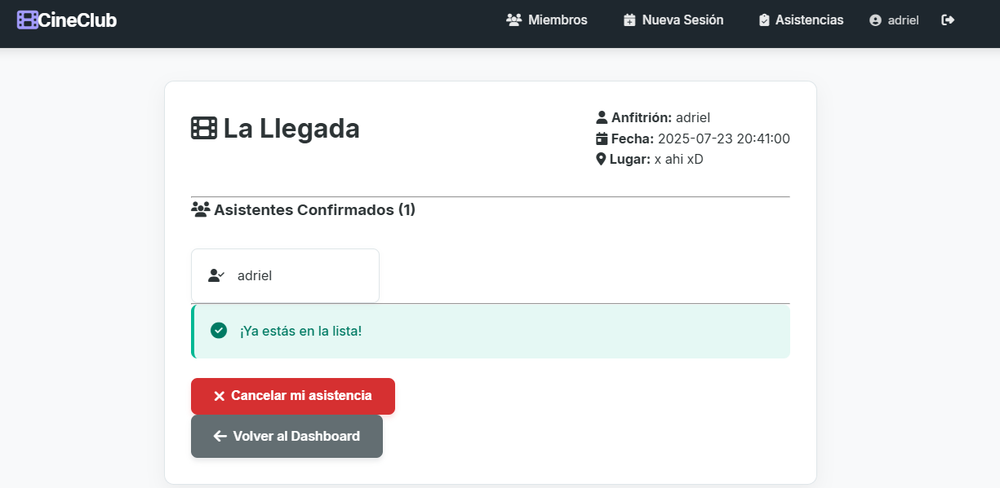

# Club-Cine

# 🎬 CineClub Connect

**URL en Producción:**  
🔗 [https://cineclub-connect.onrender.com](https://cineclub-connect.onrender.com)

---

## 📌 Descripción General

**CineClub Connect** es una plataforma web que permite gestionar clubes de cine de manera organizada y eficiente. Está diseñada para reemplazar métodos informales como grupos de WhatsApp, ofreciendo una interfaz web segura, moderna y funcional, que facilita la planificación de eventos, la gestión de miembros y el control de asistencias.

---

## 🚀 Funcionalidades

- ✅ Autenticación segura con hash de contraseñas
- 👤 Roles diferenciados: administrador y miembro
- 🎞️ Gestión de sesiones de cine (crear, ver, confirmar)
- 📅 Confirmación/cancelación de asistencia por parte de miembros
- 🧠 Automatización con funciones, procedimientos y triggers en PostgreSQL
- 📊 Dashboard con próximas sesiones y métricas
- 📥 Reportes dinámicos y formularios interactivos

---

## 🛠️ Tecnologías Utilizadas

- **Backend:** Python, Flask, Gunicorn
- **Frontend:** HTML5, CSS3, Jinja2, JavaScript
- **Base de Datos:** PostgreSQL
- **ORM:** psycopg2
- **Autenticación:** Werkzeug (hash de contraseñas)
- **Despliegue:** Render.com
- **Control de Versiones:** Git + GitHub

---

## 🖼️ Capturas

| Vista | Descripción |
|-------|-------------|
|  | Vista principal con las sesiones programadas |
|  | Login de acceso seguro |
|  | Información de la sesión y asistentes confirmados |

---

## 📦 Instalación Local

### 1. Clona el proyecto

```bash
git clone https://github.com/adriel2555/Club-Cine.git
cd Club-Cine
```

### 2. Crea un entorno virtual

```bash
# Windows
python -m venv venv
venv\Scripts\activate

# macOS/Linux
python3 -m venv venv
source venv/bin/activate
```

### 3. Instala dependencias

```bash
pip install -r requirements.txt
```

### 4. Configura las variables de entorno

Crea un archivo `.env` en la raíz del proyecto con:

```env
DB_HOST=localhost
DB_NAME=cineclub
DB_USER=tu_usuario
DB_PASSWORD=tu_contraseña
SECRET_KEY=una_clave_secreta
```

Puedes guiarte con el archivo `.env.example`.

### 5. Configura la base de datos

Asegúrate de tener PostgreSQL instalado. Luego, ejecuta estos scripts en orden (usando pgAdmin o DBeaver):

- database/create_tables.sql
- database/functions_procedures.sql
- database/triggers.sql
- database/sample_data.sql (opcional)

---

## 🌐 Despliegue en Render

1. Crea una cuenta en [Render.com](https://render.com)
2. Crea una nueva Web Service desde tu repositorio de GitHub
3. Configura:
   - Runtime: Python 3.x
   - Start command: `gunicorn app:app`
   - Build command: `pip install -r requirements.txt`
4. Agrega las variables de entorno desde tu `.env`
5. Crea también una base de datos PostgreSQL en Render y usa su URL para conectarte
6. Importante: Carga los scripts SQL a la base de datos en Render con pgAdmin o DBeaver.

---

## 🧪 Rutas del Sistema

### Autenticación

- `POST /login`: Inicia sesión del usuario
- `GET /logout`: Cierra sesión

### Sesiones de Cine

- `GET /sesion/<id>`: Ver detalles de una sesión
- `POST /sesion/<id>/confirmar`: Confirmar asistencia
- `POST /sesion/<id>/cancelar`: Cancelar asistencia

### Administración

- `GET /admin/sesiones`: Lista de sesiones programadas
- `POST /admin/sesiones/nueva`: Crear nueva sesión

---

## 👨‍💻 Autor

Desarrollado por **Adriel Carrasco**  
Proyecto académico · 2025

📧 Contacto: [GitHub Profile](https://github.com/adriel2555)

---

## 📄 Licencia

Este proyecto fue desarrollado con fines educativos. Puedes usarlo y adaptarlo para proyectos propios, citando su origen.
